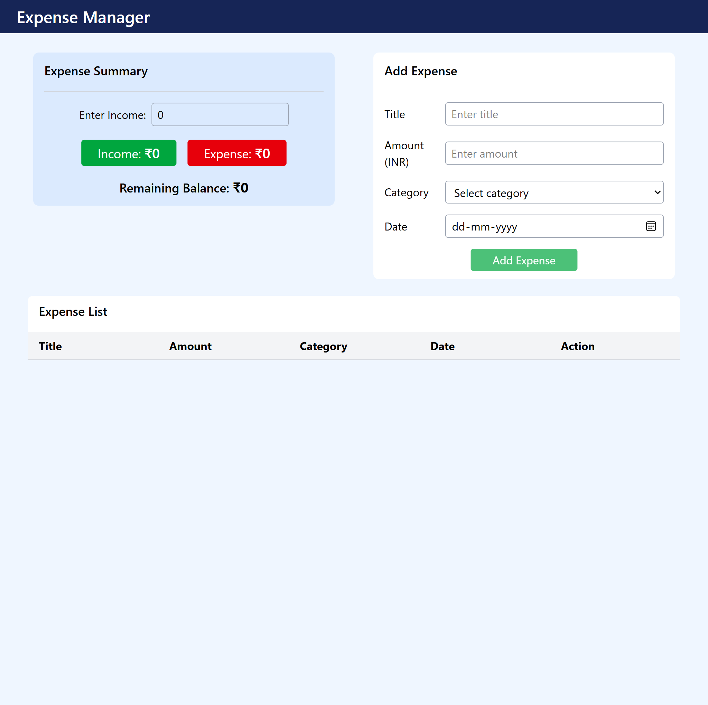

# Expense Tracker (React)

This is a simple Expense Tracker web application built using React.js and Tailwind CSS.  
The app helps users manage their daily expenses by entering their income, adding expenses, and viewing a summary of their spending.

---

## Features

- Enter income to calculate remaining balance
- Add expenses using an expense form
- Display all expenses in an expense list
- Delete any expense from the list
- Expense summary shows:
  - Total income
  - Total expense
  - Remaining balance
- Data is stored in localStorage so it is not lost on page refresh
- Responsive and clean UI using Tailwind CSS

---

## Technologies Used

- React.js
- Tailwind CSS
- JavaScript (ES6)
- HTML5
- CSS3
- LocalStorage for data persistence

---

## Screenshots

## How to Run the Project Locally

1. Clone the repository 
git clone <your-repository-link>

2. Install dependencies  
npm install

3. Start the development server  
npm run dev

4. Open the browser and go to  
http://localhost:5173

---

## Author

Built by Piyusha as a learning project using React.js and Tailwind CSS.